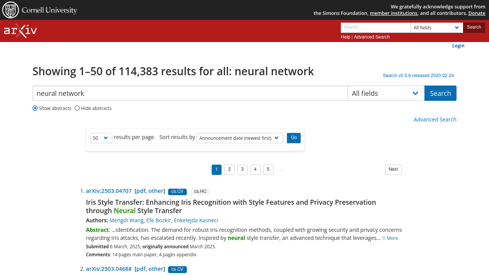

# arXiv Article Downloader

Este projeto utiliza a biblioteca **Playwright** para automatizar a busca e o download de artigos científicos em formato **PDF** do site [arXiv](https://arxiv.org/).

## Funcionalidades
- Acessa automaticamente o site do arXiv.
- Realiza uma pesquisa com um termo predefinido ("neural network").
- Coleta os links dos artigos em formato PDF.
- Faz o download dos artigos para a pasta `data/`.
- Tira uma captura de tela da página de resultados.
  


## Requisitos
Antes de executar o código, certifique-se de ter:

- Python 3.x instalado
- Playwright instalado

## Instalação
1. Clone este repositório ou copie o código.
2. Instale as dependências necessárias:
   ```sh
   pip install playwright
   playwright install
   ```
3. Crie a pasta `data/` para armazenar os arquivos baixados:
   ```sh
   mkdir data
   ```

## Execução
Para rodar o script, utilize:
```sh
python pw_scraper.py
```

## Exemplo de Saída
O código gera uma captura de tela da página de resultados e salva os arquivos PDF baixados na pasta `data/`.

## Observações
- O código pode ser modificado para aceitar um **termo de busca dinâmico**.
- Atualmente, ele está configurado para utilizar o **Firefox** (pode ser alterado para Chrome ou outro navegador compatível com Playwright).
- Caso o site do arXiv mude seu layout, pode ser necessário atualizar os seletores usados no código.

## Licença
Este projeto está sob a licença MIT. Sinta-se à vontade para usar e modificar!

